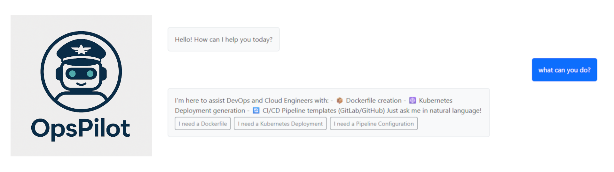

[](https://github.com/d4niee/OpsPilot/actions/workflows/build.yml)
[](https://github.com/d4niee/OpsPilot/actions/workflows/build_and_push_backend.yml)
[](https://github.com/d4niee/OpsPilot/actions/workflows/build_and_push_frontend.yml)
[](https://github.com/d4niee/OpsPilot/actions/workflows/security_checks.yml)

Chat Demo: https://chat.daniel-lambrecht-dev.de/

# OpsPilot
OpsPilot is a Rasa Chatbot designed to generate dockerfiles, K8s Manifests and Pipeline Templates
intelligent, conversation-based chatbot to support developers in DevOps tasks - self-hosted, extensible and specialized in infrastructure-as-code, CI/CD and containerization.

</img>
---

This project uses [Poetry](https://python-poetry.org) for dependency management and [Rasa](https://rasa.com) for development for the NLP chatbot.

---

## 📦 Installation

install dependencies:
```bash
poetry install --no-root
```

(optional) add dependency
```bash
poetry add <package name>
```

---

## 🐍 Activate environment (optional)

```bash
poetry run <command>
# or with poetry plugin
poetry self add poetry-plugin-shell
poetry shell
```

## Train the Model
```
chmod +x ./scripts/train_model.sh 
./scripts/train_model.sh 
```

## !!! Run Locally with Docker
'to Run the bot locally just run:
```bash
docker-compose up -d --build
```
Start up all services. This activates the following:
- rasa-chatbot
- rasa-chatbot-frontend
- rasa-action-server

It can take a while to start up the first time as all the images have to be drawn and built first.

After starting, you can navigate to
at http://localhost:8080

To exit the environment simply
```bash
docker-compose down
```

Login data of the front end
```
user: dev
password: sose2025
```

##  Performing locally with poetry

Rasa API Launch
```bash
poetry run rasa run --enable-api --cors "*" --debug
```
Rasa Action server launch
```bash
poetry run rasa run actions
```

launch frontend
```bash
cd frontend && yarn dev
```

---

## 🚀  Rasa + Poetry commands (Cheat Sheet)

| **Rasa Command**            | **Beschreibung**                                                                 | **Mit Poetry ausführen**              |
|----------------------------|-----------------------------------------------------------------------------------|----------------------------------------|
| `rasa init`                | Erstellt ein neues Projekt mit Beispieldaten                                      | `poetry run rasa init`                |
| `rasa train`               | Trainiert ein Modell und speichert es in `./models`                               | `poetry run rasa train`               |
| `rasa interactive`         | Interaktive Trainingssession                                                      | `poetry run rasa interactive`         |
| `rasa shell`               | Öffnet eine CLI-Chat-Session mit deinem Bot                                       | `poetry run rasa shell`               |
| `rasa run`                 | Startet den Rasa-Server                                                            | `poetry run rasa run`                 |
| `rasa run actions`         | Startet den Action-Server mit dem Rasa SDK                                        | `poetry run rasa run actions`         |
| `rasa visualize`           | Generiert eine visuelle Darstellung deiner Stories                                | `poetry run rasa visualize`           |
| `rasa test`                | Führt Tests auf einem trainierten Modell aus                                      | `poetry run rasa test`                |
| `rasa test e2e`            | Führt End-to-End-Tests inklusive Actions durch                                    | `poetry run rasa test e2e`            |
| `rasa data split nlu`      | Teilt die NLU-Daten im Verhältnis 80/20                                           | `poetry run rasa data split nlu`      |
| `rasa data split stories`  | Teilt die Story-Daten im Verhältnis 80/20                                         | `poetry run rasa data split stories`  |
| `rasa data convert`        | Konvertiert Trainingsdaten in andere Formate                                      | `poetry run rasa data convert`        |
| `rasa data migrate`        | Migriert Domain-Dateien von Rasa 2.x zu 3.x                                       | `poetry run rasa data migrate`        |
| `rasa data validate`       | Prüft Domain-, NLU- und Story-Daten auf Konsistenz                                | `poetry run rasa data validate`       |
| `rasa export`              | Exportiert Konversationen aus dem Tracker Store                                   | `poetry run rasa export`              |
| `rasa evaluate markers`    | Extrahiert Marker aus dem Tracker Store                                           | `poetry run rasa evaluate markers`    |
| `rasa marker upload`       | Lädt Marker-Konfigurationen zu Analytics hoch                                     | `poetry run rasa marker upload`       |
| `rasa license`             | Zeigt Lizenzinformationen an                                                      | `poetry run rasa license`             |
| `rasa -h`                  | Listet alle verfügbaren Rasa-Kommandos auf                                        | `poetry run rasa -h`                  |


## 🎯 Goal of the Project

The aim of this project is to develop a specialized, contextual chatbot that:
- primarily:
    - Generate Dockerfile templates (customized for language, tools/technologies, build type)
    - Create CI/CD pipeline templates for GitHub Actions or GitLab CI (or both depending on how much time)
    - conducts structured dialogs to query user-specific requirements
    - runs locally, offline and completely in your own cluster if desired
- optional:
    - kubernetes deployment templates (YAML)

---

## 🛠️ Technology-Stack

| Komponente        | Technologie                     |
|-------------------|----------------------------------|
| **Bot-Framework** | [Rasa Open Source](https://rasa.com) |
| **Template Engine** | Jinja2 (Dockerfiles, YAML etc.) |
| **Backend-Logik** | Python (Custom Actions)          |
| **Frontend**       | React Typescript frontend powered by Vite and bootstrap for styling    |
| **Deployment**     | Kubernetes (K3s), Helm, Traefik or local with docker |
| **CI/CD** | GitHub Actions, GitLab CI       |

---

## 🤖 Example Dialoge (Prototype)

> **User:** I need a Dockerfile
> **Bot:** yarn or npm? 
> **User:** npm  
> **Bot:** image version? 
> **User:** 20
> **Bot:** ✅ here is your dockerfile: <file>

---
